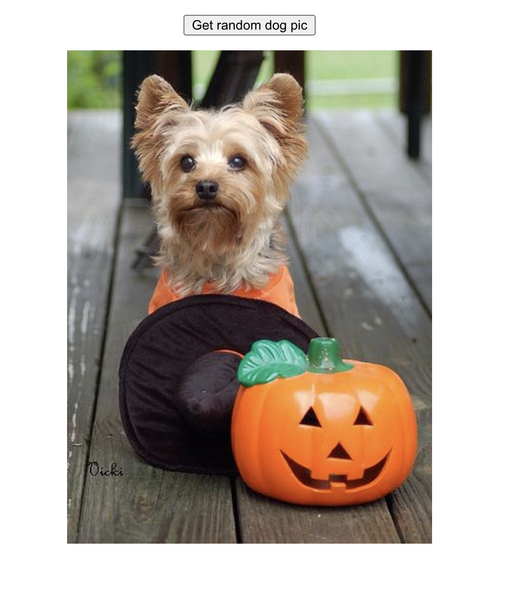

# Axois Lab 

## Installation Guid 
* create react app 
* cd into your app
* excute this code `npm install axios` into your terminal 
* link this script `` to the index.html 

## Sending http request with axois 
* go through this [dog api](https://dog.ceo/dog-api/) documentation 
* use axois to get a random picture of a dog every time you press a button 

